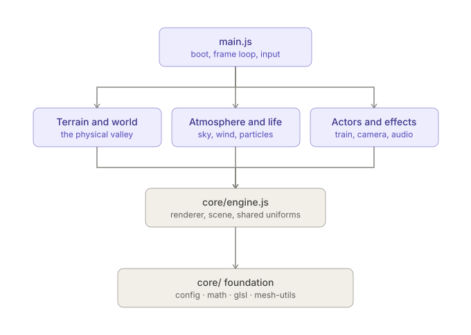

original index_original.html is copied from 

<https://codepen.io/editor/lentils801/pen/019f9b4b-10d7-7f77-817f-f4eb83fdb289>

To study the AI generated code (Claude Opus-5), it is refactored into a vite project by Claude with the following prompt

>Take the file tmp.html and refactor it into a vite project, i.e., separate into .html, .js, .css and tell me what npm package to install to populate package.json

and then accepted Claude's suggestion to break it down further. 

When asked Claude to explain the project structure: 

> 
> 
> 
> That diagram shows the shape of it: dependencies only point **downward**. `main.js` depends on the domain modules, which depend on `core/engine.js`, which depends on the foundational `core/` modules — nothing at the bottom depends on anything above it. That's what makes it safe to reason about.
> 
> Here's what's actually in each layer:
> 
> **`core/` — the foundation, everything else builds on this**
> - `config.js` — numeric constants, quality presets, the color palette, and `QS` (URL query params)
> - `math.js` — noise functions, easing curves, a seeded RNG — pure math, no THREE.js
> - `glsl.js` — shared GLSL snippets (lighting, fog, terrain sampling, wind) that get spliced into almost every shader in the project as template strings
> - `engine.js` — the one renderer, one scene, one camera. Also the shared uniform object `G` (things like sun direction, time, camera position) that every shader reads from, plus the `RSM`/`DSM` helpers that build materials
> - `mesh-utils.js` — the hand-mesh toolkit (`pbox`, `pcyl`, `finishPainted`...) used to build the train, the village, the viaduct stones
> 
> **Domain modules — one concern each, built on `core/`**
> Terrain and world: `terrain.js` (heightmap + baking), `railway.js` (track grading), `viaduct.js` (the bridge), `world.js` (collision), `village.js`, `trees.js`, `river.js`.
> Atmosphere: `sky.js`, `wind.js`, `particles.js`.
> Actors: `train.js`, `grass.js`, `camera.js` (the Walker), `audio.js`, `post.js` (bloom/composite).
> 
> **`main.js` — the only file that imports *everything***
> It doesn't do much "real work" itself — it's `boot()` (calls each module's builder function in the right order: bake terrain → build track → build viaduct → scatter trees → ...), the per-frame render passes (shadow, reflection, wind, post), and input handling.
> 
> A couple of things worth knowing if you go poking around:
> 
> - **Modules mostly don't talk to each other directly** — they talk to `core/` and to `main.js` calls them. The one place two domain modules import from each other is `railway.js` importing `BR` from `viaduct.js` (the track needs to know where the bridge deck is), which is fine since it's a one-way dependency.
> - **State that used to be a shared global is now passed as a parameter.** For example, `updateSmoke(dt)` used to just close over a global `smoke` variable; now it's `updateSmoke(dt, smoke)`, with `main.js` owning `smoke` and threading it through. Same pattern for the motes/birds particle systems and the village smoke-chimney list.
> - **There's exactly one place I had to be careful about circular imports**: `terrain.js`, `railway.js`, and `viaduct.js` all logically depend on each other a little (the track needs the terrain, the bridge needs the river, the terrain-baking wants to know where the track is). I broke that by having `terrain.js` accept `TRACK` as a function *parameter* to `bakeSplat()` rather than importing it — so the only remaining cross-module relationship is one-directional.
> 
> If you want to change how the grass looks, you're only ever touching `grass.js` and maybe `core/glsl.js`. If you want to add a new building, you're in `village.js`. That's the actual payoff of the split — you don't need to hold the other 5,000 lines in your head to make one change.

However, is this how people normally organize a project like this? It seems overly complicated. 

